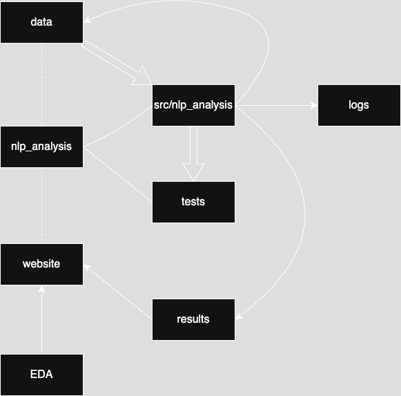

# NLP Analysis of Media Bias Trends

## Project Overview

This project analyzes long-term media trends and potential biases in U.S. political news coverage using natural language processing (NLP). We extracted over 300,000 news article records from the GDELT Global Knowledge Graph, sampling headlines monthly from FOX News (right-leaning), MSNBC (left-leaning), and ABC News (centrist). Our final product is a dynamic, interactive website that visualizes sentiment, topic modeling, and half-life analysis across news sources over a ten-year period.

The goal is to provide a transparent, data-driven view of media discourse, helping users explore how topics rise, persist, or fade across political ideologies—especially around major events like presidential elections and the COVID-19 pandemic.

Explore the final site here:
👉 [Our Website](https://viviluccioli.github.io/DSAN5400_final_project/)


## The Team 

- Viviana Luccioli (vcl16@georgetown.edu)
- Kristin Lloyd (kml301@georgetown.edu)
- Ria Sonawane (rs2261@georgetown.edu)
- Zixu Hao (zh301@georgetown.edu)


## Project architecture 

```
.
├── EDA                             # Exploratory Data Analysis 
├── data                            # Data files
│   ├── abc                         # ABC News data
│   ├── fox                         # FOX News data
│   ├── msnbc                       # MSNBC News data
│   └── topic_modeling              # Topic modeling results
├── logs                            # Output logs  
├── nlp_analysis                    # Core NLP analysis scripts
│   ├── src
│   │   └── nlp_analysis
│   │       ├── __init__.py
│   │       ├── half_life.py        # Half life modeling module
│   │       ├── semantic.py         # Sentiment analysis module
│   │       ├── topic_modeling.py   # Topic modeling module
│   │       └── utils.py
│   ├── tests                       # Pytest test suite
│   │   ├── half_life_test.py
│   │   ├── semantic_test.py
│   │   └── topic_modeling_test.py
│   ├── README.md                   # NLP project-specific documentation
│   ├── poetry.lock                 # Poetry lock file
│   └── pyproject.toml              # Poetry project file
├── results                         # Output results
│   └── topic_modeling
├── website                         # Quarto website files
├── docs                            # Rendered Quarto website
├── README.md
└── environment.yml                 # Conda environment file
```


All of these files and folders interact to create a cohesive project. The flow diagram below illustrates how the data and NLP methods flow through the project:



The project is composed of three main layers, which will be described in more detail below: 

1. Data Extraction

- Query GDELT via Google BigQuery to download monthly data for each source (FOX, MSNBC, ABC)
- We sampled 1,000 articles from each of these sources from each month from each year from Feb 2015–Mar 2025

2. NLP Analysis Python Project (nlp_analysis/)

- Scripts perform topic modeling, sentiment analysis, and half-life modeling

3. Website (website/)

- A Quarto-based site that visualizes the analysis with interactive, time-aware components for user education


## Key Features 

- **Topic Modeling** using LDA to extract dominant themes per media source
- **Half-Life Modeling** to analyze how long topics remain relevant in media coverage
- **Sentiment Analysis** using VADER and AFINN
- *Logging* of script output to a logs/ directory
- Comprehensive *testing* with pytest, including integration and edge case tests

## NLP Analysis 

This python project is a modular NLP toolkit for analyzing trends in U.S. news media coverage across ABC, MSNBC, and FOX News from 2015 to 2025. It performs automated topic modeling, sentiment and polarization analysis, and topic half-life decay modeling to better understand how themes emerge, persist, or polarize across networks. Built using Python 3.12 and poetry, it is designed with reproducibility and modularity in mind. Each script can be run independently from the command line, and all functionality is fully tested using pytest.

### Python project features

- 🔍 Topic Modeling (LDA on headlines & metadata)
- 📉 Half-Life Modeling (decay of topics over time)
- 😊 Sentiment Analysis (VADER and AFINN)
- 🪵 Logging to logs/ folder
- ✅ Fully unit-tested with pytest

For more information, please refer to the [nlp_analysis/README.md](nlp_analysis/README.md) file. 


## The Website 

Our website lets you explore how media tone and topics have changed across FOX, ABC, and MSNBC from February 2015 to March 2025.

The main calendar view shows each month shaded by the average tone across all three networks—lighter colors indicate more positive sentiment, darker colors more negative.
Click on a month to dive deeper: you'll see each outlet’s tone for that month and their top 3 topics, letting you compare what each source focused on at that time.

Scroll through months to see how tone and topic coverage shifted during key events like elections or the COVID-19 pandemic.

Other pages explain our methods, show detailed visualizations, and provide context behind the analysis. Check them out for a deeper understanding of our methods and findings.

- 🌐 Built with Quarto
- 🗓️ Calendar-style layout from Feb 2015–Mar 2025.
- 🎨 Monthly tone visualized via color shading.
- 🔍 Click a month to see:
    - Each network’s tone
    - Top 3 topics per source
- 📊 Explore pages for detailed EDA and method explanations.


## Installation and Usage

1. Clone the repository:

```bash
git clone https://github.com/viviluccioli/DSAN5400_final_project.git
cd DSAN5400_final_project
```

2. Create the conda environment:

```bash
conda env create -f environment.yml
conda activate dsan5400
```

3. Run the analysis modules:

```bash
cd nlp_analysis
poetry run python src/nlp_analysis/topic_modeling.py
poetry run python src/nlp_analysis/half_life.py
poetry run python src/nlp_analysis/semantic.py
```

4. Run the test suite: 

```bash
poetry run pytest tests/ -v
```

**Note**: the analysis and test scripts in nlp_analysis each have instructions at the top of the file for how to run them

## Technical notes

- Code is formatted and cleaned using black, ruff, and pylint
- Conda environment is defined in environment.yml
- All logs are saved in the root logs/ folder
- Each script is modular and independently runnable via terminal
- Data is stored externally, using Git LFS (not in GitHub due to size)